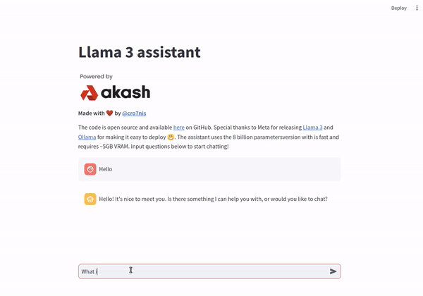

# llama3-assistant
Llama 3 assistant powerered by [Ollama](https://ollama.com/) and [Streamlit](https://streamlit.io/). Special thanks to Meta for releasing [Llama 3](https://ai.meta.com/blog/meta-llama-3/) 

The assistant uses the 8B-parameter model which is fast and requires ~5GB VRAM and it can even run on CPU with reasonable speed.

The project is developed for the "[Create and deploy guide](https://zealy.io/cw/akashnetwork/questboard/e9061118-f7f6-4430-b974-c989d79c13da/3e820013-25f9-4c7f-9856-c2c82eebb86d)" zealy task which is hosted by Akash.

## Deploy on Akash guide  

- Create and fund a Keplr or Leap wallet
  - [Keplr wallet](https://akash.network/docs/getting-started/token-and-wallets/#keplr-wallet)
  - [Leap wallet](https://akash.network/docs/getting-started/token-and-wallets/#leap-cosmos-wallet)
- Visit https://deploy.cloudmos.io/
- Connect your wallet
  - You need to have at least 5 AKT
- Press the deploy button
- Select "Build your template"
- (Optional) Name your deployment
- Select YAML and paste the [deploy.yaml](deploy.yaml) contents
- Press "Create Deployment"
- Accept wallet transaction
- Review bids and select provider
- Accept provider transaction
- Go to LEASES and press the URI
- Check the [Akash docs](https://akash.network/docs/deployments/cloudmos-deploy/) if you have and questions
- Start chatting!

